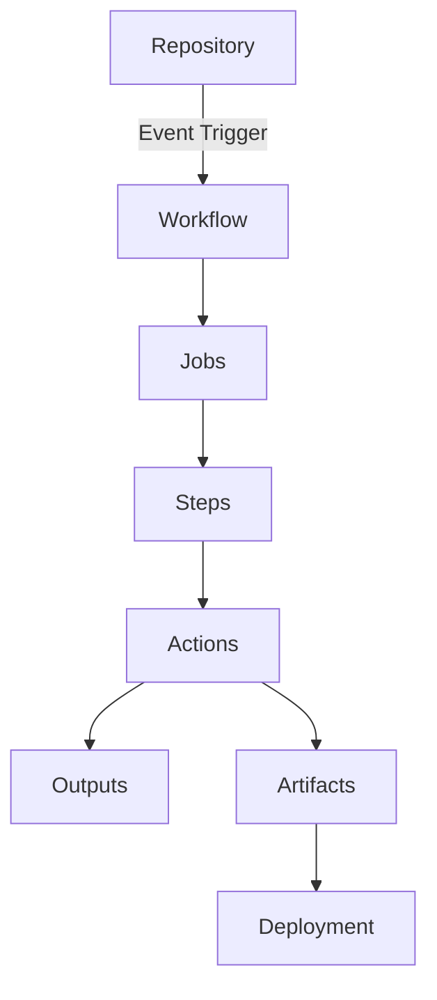
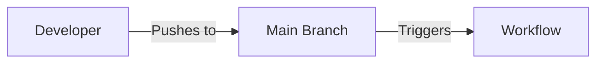
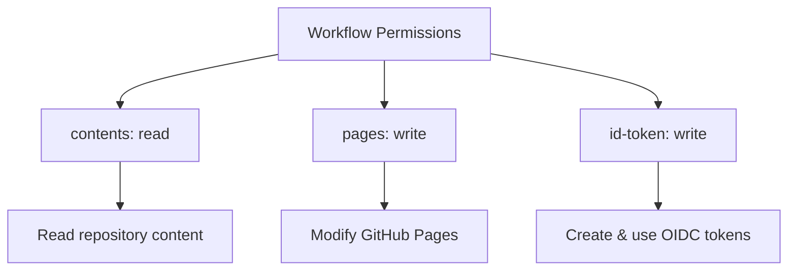
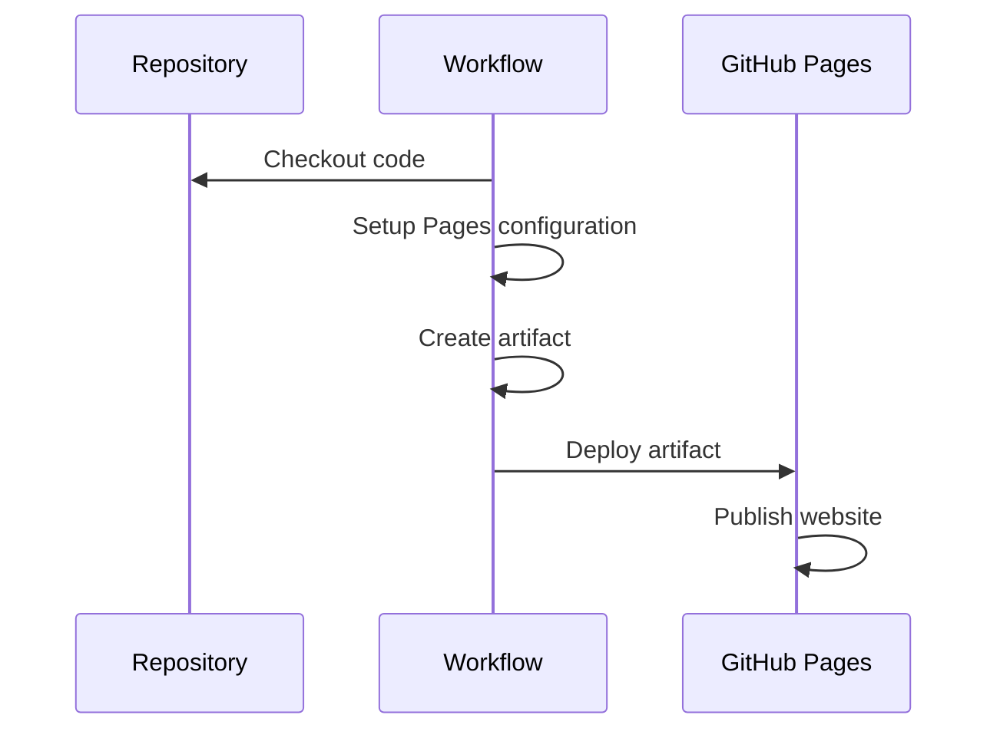
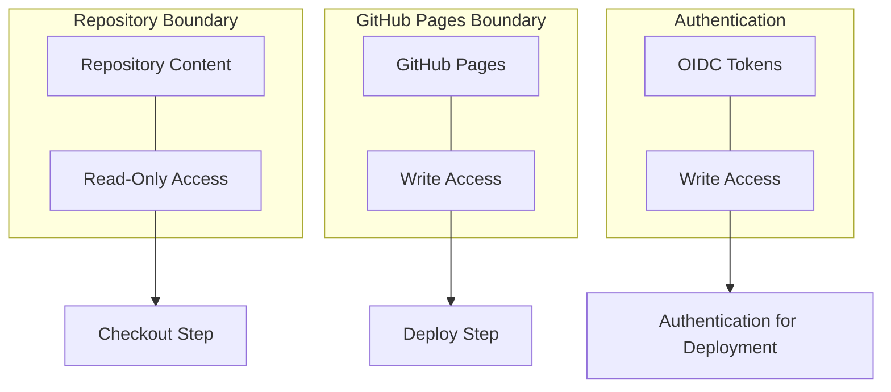
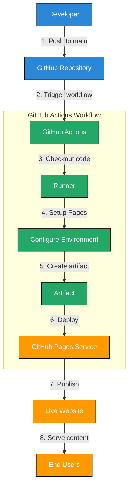

# Automating Deployments with GitHub Actions: A First Principles Approach

*Published: March 14, 2025*

## Introduction

In the world of modern software development, automation is not just a convenience but a necessity. Continuous Integration and Continuous Deployment (CI/CD) have become fundamental practices that enable developers to deliver software updates rapidly and reliably. At the heart of this revolution is GitHub Actions, a powerful automation platform integrated directly into the GitHub ecosystem.

This blog post explores GitHub Actions from first principles, breaking down the concepts and components that make automated deployments possible. Using a real-world example of deploying a static website to GitHub Pages, we'll examine the underlying mechanics and best practices of GitHub Actions workflows.

## Understanding CI/CD from First Principles

Before diving into the technical details, let's understand the fundamental concepts behind CI/CD:

1. **Continuous Integration (CI)**: The practice of frequently integrating code changes into a shared repository, followed by automated builds and tests.
2. **Continuous Deployment (CD)**: The practice of automatically deploying every change that passes all test stages to production.

At their core, these practices address a fundamental challenge in software development: **how to safely and efficiently move code from development to production**.

The fundamental components of any CI/CD system include:

- **Triggers**: Events that initiate the automation workflow
- **Runners**: Environments where the automation tasks are executed
- **Steps**: Individual tasks to be performed
- **Artifacts**: Files produced during the workflow execution
- **Environments**: Deployment targets with specific configurations

## GitHub Actions: Architecture and Components

GitHub Actions is built on a simple yet powerful model that follows these first principles. Let's visualize its architecture:



The key components are:

1. **Workflows**: YAML files that define the automation process
2. **Events**: Triggers like push, pull request, or scheduled events
3. **Jobs**: Groups of steps that execute on the same runner
4. **Steps**: Individual tasks that run commands or actions
5. **Actions**: Reusable units of code that can be shared and consumed
6. **Runners**: The compute infrastructure where workflows run

## Anatomy of a GitHub Pages Deployment Workflow

Let's examine our example project's workflow file from first principles. The workflow is defined in `.github/workflows/deploy.yml`:

```yaml
name: Deploy to GitHub Pages

on:
  push:
    branches:
      - main

permissions:
  contents: read
  pages: write
  id-token: write

jobs:
  deploy:
    environment:
      name: github-pages
      url: ${{ steps.deployment.outputs.page_url }}
    runs-on: ubuntu-latest
    steps:
      - name: Checkout
        uses: actions/checkout@v4
      - name: Setup Pages
        uses: actions/configure-pages@v4
      - name: Upload artifact
        uses: actions/upload-pages-artifact@v3
        with:
          path: '.'
      - name: Deploy to GitHub Pages
        id: deployment
        uses: actions/deploy-pages@v4
```

This seemingly simple file encapsulates several fundamental principles:

### 1. **Event-Driven Architecture**

The workflow is triggered by a specific event: a push to the main branch.



### 2. **Declarative Configuration**

The entire workflow is defined declaratively, stating what should happen rather than how. This follows the principle of **infrastructure as code**.

### 3. **Security-First Design**

The `permissions` section explicitly defines the minimal set of permissions needed, following the principle of least privilege:



### 4. **Sequential Pipeline Architecture**

The steps form a sequential pipeline, where each step builds on the previous one:



## Breaking Down the Workflow: Step-by-Step Analysis

Let's examine each step of the workflow from first principles:

### 1. Checkout

```yaml
- name: Checkout
  uses: actions/checkout@v4
```

This step fetches the repository content. It's fundamental because:
- It provides the workflow with access to the source code
- It allows the workflow to operate on the latest version of the code
- Without it, the workflow would have nothing to deploy

### 2. Setup Pages

```yaml
- name: Setup Pages
  uses: actions/configure-pages@v4
```

This step configures the GitHub Pages environment. It's necessary because:
- It initializes the required environment variables
- It sets up the underlying GitHub Pages infrastructure
- It prepares the system for artifact upload and deployment

### 3. Upload Artifact

```yaml
- name: Upload artifact
  uses: actions/upload-pages-artifact@v3
  with:
    path: '.'
```

This step packages the site content. It follows the principle of **immutable artifacts**:
- It creates a snapshot of the site at a specific point in time
- It provides a consistent package that can be deployed
- It enables potential rollbacks by preserving the artifact

### 4. Deploy

```yaml
- name: Deploy to GitHub Pages
  id: deployment
  uses: actions/deploy-pages@v4
```

The final step actually publishes the site. It embodies the principle of **separation of concerns**:
- Building the artifact and deploying it are separate operations
- This allows for different permissions and controls at each stage
- It supports a more secure deployment pipeline

## The Principle of Least Privilege in Action

One of the most important security principles is providing only the minimum permissions necessary. Our workflow demonstrates this with:

```yaml
permissions:
  contents: read
  pages: write
  id-token: write
```

This explicit permission model:
- Prevents the workflow from modifying repository content
- Allows writing only to GitHub Pages
- Provides identity token access for secure deployments

Let's visualize how these permissions integrate with the workflow:



## Environment-Based Deployment

The workflow uses a specific environment for deployment:

```yaml
environment:
  name: github-pages
  url: ${{ steps.deployment.outputs.page_url }}
```

This follows the principle of **environment segregation**:
- Deployment targets are explicitly defined
- Each environment can have its own protection rules
- Deployment URLs are tracked and linked to the workflow

## First Principles of Static Site Deployment

Our example deploys a simple static HTML site:

```html
<!DOCTYPE html>
<html lang="en">
<head>
    <meta charset="UTF-8">
    <meta name="viewport" content="width=device-width, initial-scale=1.0">
    <title>My GitHub Pages Site</title>
    <!-- CSS styling omitted for brevity -->
</head>
<body>
    <div class="container">
        <h1>Hello, GitHub Actions!</h1>
        <p>This site is deployed using GitHub Actions and GitHub Pages.</p>
        <p>Last updated: February 4, 2025 at 10:10 AM IST</p>
    </div>
</body>
</html>
```

From first principles, deployment of static content requires:
1. **Content Storage**: A place to store the HTML, CSS, and JavaScript files
2. **Content Serving**: A web server to deliver the files to browsers
3. **Content Delivery**: A way to efficiently distribute the content

GitHub Pages handles all three aspects:
- It stores the content in GitHub's infrastructure
- It serves the content via GitHub's servers
- It delivers the content via GitHub's CDN

## The Complete Deployment Flow

Let's visualize the entire process from code push to website delivery:



## Implementation Considerations

When implementing GitHub Actions workflows from first principles, consider:

### 1. Workflow Isolation

Each workflow should have a single responsibility. For our static site, deployment is the sole responsibility. For more complex applications, you might have separate workflows for:
- Building and testing
- Security scanning
- Deployment to staging
- Deployment to production

### 2. Artifact Immutability

Once created, artifacts should not be modified. This ensures consistency across environments and enables reliable rollbacks.

### 3. Idempotent Deployments

Deployments should be idempotent - running the same deployment multiple times should result in the same final state.

### 4. Failure Handling

Workflows should fail fast and provide clear error messages. This reduces troubleshooting time and improves developer experience.

## Extending the Workflow

From first principles, we can extend our basic workflow to include additional steps:

### 1. Testing

Add automated tests to verify site functionality:

```yaml
- name: Test
  run: |
    npm install -g htmlhint
    htmlhint index.html
```

### 2. Performance Optimization

Optimize assets before deployment:

```yaml
- name: Optimize
  run: |
    npm install -g html-minifier
    html-minifier --collapse-whitespace index.html -o index.html
```

### 3. Security Scanning

Add security checks to prevent vulnerable code from being deployed:

```yaml
- name: Security scan
  uses: aquasecurity/trivy-action@master
  with:
    scan-type: 'fs'
    format: 'table'
```

## Conclusion: From Principles to Practice

By understanding GitHub Actions from first principles, we gain insights beyond simply following tutorials:

1. **We understand why each component exists**: Each part of the workflow serves a specific purpose in the deployment pipeline.

2. **We can troubleshoot effectively**: Knowledge of the underlying principles helps identify and fix issues when they arise.

3. **We can extend and customize**: Instead of blindly copying examples, we can adapt workflows to our specific needs.

4. **We make better security decisions**: Understanding the permission model allows us to implement the principle of least privilege.

GitHub Actions workflows embody fundamental software engineering principles: separation of concerns, infrastructure as code, principle of least privilege, and immutable artifacts. By applying these principles to our deployments, we create robust, secure, and maintainable automation pipelines.

The next time you set up a GitHub Actions workflow, consider the principles behind each configuration option. This first-principles approach will lead to more thoughtful and effective automation strategies.

---

*Would you like to learn more about CI/CD principles or explore more advanced GitHub Actions workflows? Let me know in the comments below!*
